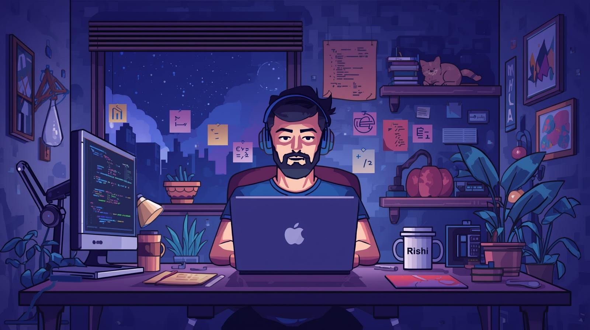

<!-- Profile Header with GIF -->
<h3 align="center">
  
</h3>

<h1 align="center">
  
</h1>

<h2 align="center">
  🤖 | ⚡ | 🎯 | 👨‍💻 | 🧠
</h2>

---

# 👋 About Me

<h3>Hi, I’m <b>Rishi Bhardwaj</b> – Driven by curiosity, I'm a Front-End Developer and AI enthusiast who builds scalable solutions and explores innovative tech to create real-world impact. I build tech solutions for real-world challenges. I specialize in scalable web apps and am constantly learning to craft impactful, AI-driven technology.</h3>

---

# 💻 My favorite tools and technologies

<table align="center">
  <tr>
    <td align="center" width="96">
      
       Python
    </td>
    <td align="center" width="96">
        
       JavaScript
    </td>
    <td align="center" width="96"> 
        
       Git
    </td>
    <td align="center"  width="96">
        
       HTML5
    </td>
    <td align="center" width="96">
        
       CSS
    </td>
  </tr>
</table>
  

  

---

<h2 align="center">
  <b>Let’s build something amazing together!</b>
</h2> 

  
  

###

###

  

###

<picture>
  <source media="(prefers-color-scheme: dark)" srcset="https://raw.githubusercontent.com/RishiByte/RishiByte/output/pacman-contribution-graph-dark.svg">
  <source media="(prefers-color-scheme: light)" srcset="https://raw.githubusercontent.com/RishiByte/RishiByte/output/pacman-contribution-graph.svg">
  
</picture>

###

  
  
  

###