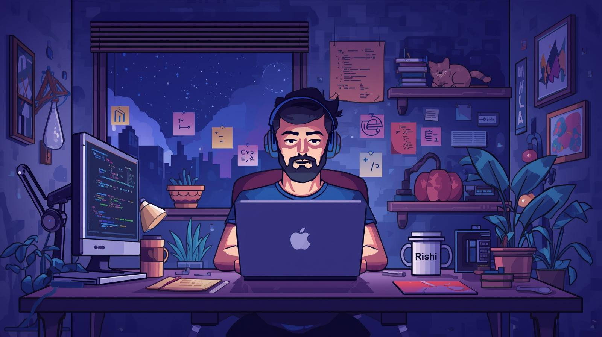

<!-- Profile Header with GIF -->
<h3 align="center">
  
</h3>

<h1 align="center">
  
</h1>

<h2 align="center">
  🤖 | ⚡ | 🎯 | 👨‍💻 | 🧠
</h2>

---

# 👋 About Me

<h3>Hi, I’m <b>Rishi Bhardwaj</b> — a frontend developer focused on building modern, interactive web apps with React and AI integrations. I enjoy open source, hackathons, and creating products that solve real student problems.

Currently:
- Building full-stack projects
- Solving DSA in Python
- Exploring open source
- Learning system design</h3>

---

# 💻 Tech Stack

<h3 align="center">Frontend</h3>
<table align="center">
  <tr>
    <td align="center" width="96">
      
       React
    </td>
    <td align="center" width="96">
      
       HTML5
    </td>
    <td align="center" width="96">
      
       CSS3
    </td>
    <td align="center" width="96">
      
       Tailwind
    </td>
    <td align="center" width="96">
      
       Bootstrap
    </td>
  </tr>
</table>

 

<h3 align="center">Backend</h3>
<table align="center">
  <tr>
    <td align="center" width="96">
      
       Node.js
    </td>
    <td align="center" width="96">
      
       Express.js
    </td>
  </tr>
</table>

 

<h3 align="center">Languages</h3>
<table align="center">
  <tr>
    <td align="center" width="96">
      
       JavaScript
    </td>
    <td align="center" width="96">
      
       Python
    </td>
    <td align="center" width="96">
      
       C++
    </td>
    <td align="center" width="96">
        
       TypeScript
    </td>
  </tr>
</table>

 

<h3 align="center">Tools</h3>
<table align="center">
  <tr>
    <td align="center" width="96">
      
       Git
    </td>
    <td align="center" width="96">
      
       GitHub
    </td>
    <td align="center" width="96">
      
       VS Code
    </td>
    <td align="center" width="96">
      
       Webpack
    </td>
  </tr>
</table>
  

  

---

<h2 align="center">
  <b>Let’s build something amazing together!</b>
</h2> 
# 🚀 Featured Projects

<table>
<tr>
<td width="50%">

## 🌌 Poke Multiverse

A Pokémon multiverse web app with character search, battle stats, and interactive UI powered by PokéAPI.

### ⚡ Tech Stack
`React` `Tailwind CSS` `API Integration`

🔗 [Live Demo](https://pokii-multiverse.netlify.app/)  
📂 [Repository](https://github.com/RishiByte/Pok-Multiverse)

</td>

<td width="50%">

## 💪 The Iron Garage

A modern fitness platform with workout plans, responsive UI, and clean animations.

### ⚡ Tech Stack
`React` `TypeScript` `Tailwind CSS` `Next.js 15 App Router`

🔗 [Live Demo](https://theirongarage.netlify.app/)  
📂 [Repository](https://github.com/RishiByte/The-Iron-Garage)

</td>
</tr>

<tr>
<td width="50%">

## 🤖 Discord Clone

Real-time Discord-inspired chat application with modern UI and messaging features.

### ⚡ Tech Stack
`React` `Tailwind CSS`

🔗 [Live Demo](https://discord-clone-rouge-one.vercel.app)  
📂 [Repository](https://github.com/RishiByte/Discord-Clone)

</td>

<td width="50%">

## 📚 Tap Tap Luffy

Anime-inspired tapping game built with interactive gameplay and smooth UI.

### ⚡ Tech Stack
`JavaScript` 

🔗 [Live Demo](https://tap-tap-luffy.vercel.app/)  
📂 [Repository](https://github.com/RishiByte/TapTapLuffy)

</td>
</tr>
</table>

  
# 🧠 Coding Profiles

###

  <a href="https://github.com/RishiByte/beautiful-github-homepage"><picture></picture></a>
  <a href="https://github.com/RishiByte/beautiful-github-homepage"><picture></picture></a>
  

 

  

